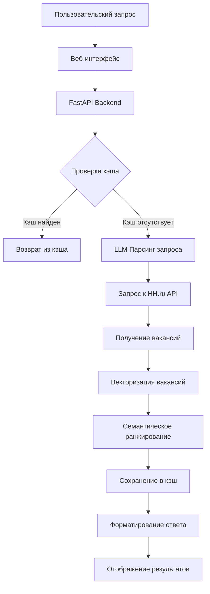

# Архитектурное видение: Career Aggregator 2

## Обзор проекта
Career Aggregator 2 — это MVP (минимально жизнеспособный продукт) для семантического поиска вакансий с интеграцией HH.ru. Система предоставляет веб-интерфейс для поиска вакансий с использованием LLM для парсинга запросов и семантического ранжирования результатов.

## Цели и ограничения

### Бизнес-цели
1. Предоставить пользователям улучшенный поиск вакансий через семантическое понимание запросов
2. Агрегировать данные из HH.ru без необходимости регистрации/оплаты
3. Создать прототип для тестирования архитектурных решений

### Технические ограничения
- **Источник данных**: только HH.ru API (бесплатные методы)
- **Максимум вакансий**: 2000 за запрос
- **Без токена**: поиск работает без аутентификации
- **User-Agent**: обязателен для всех запросов

## Архитектурные принципы

1. **Минимализм**: MVP с фокусом на основной функциональности
2. **Модульность**: разделение компонентов для легкого тестирования и замены
3. **Кэширование**: агрессивное кэширование для снижения нагрузки на внешние API
4. **Без состояния**: минимальное хранение данных, преимущественно in-memory кэш

## Компонентная архитектура

### Основные компоненты

#### 1. Веб-интерфейс (Streamlit/Gradio)
- Одностраничное приложение
- Поисковая форма с текстовым полем
- Базовые фильтры (город, опыт, график)
- Отображение результатов с пагинацией

#### 2. Бэкенд API (FastAPI)
- REST API для обработки запросов
- Оркестрация потока данных
- Управление бизнес-логикой
- Обработка ошибок и валидация

#### 3. LLM Service (DeepSeek API)
- Парсинг естественно-языковых запросов
- Структурирование параметров поиска
- Извлечение сущностей (профессия, локация, опыт)

#### 4. Embedding Service (Sentence-Transformers)
- Векторизация текста вакансий и запросов
- Расчет косинусного сходства
- Семантическое ранжирование результатов

#### 5. Cache Service (in-memory)
- LRU кэш для частых запросов
- Кэширование эмбеддингов
- TTL управление для актуальности данных

#### 6. HH.ru Integration
- Клиент для API HH.ru
- Обработка пагинации
- Преобразование данных в единый формат

## Поток данных

### Основной сценарий поиска

### Детальный поток

1. **Ввод запроса**: пользователь вводит текст (например, "системный аналитик, минск, сеньор")
2. **Парсинг LLM**: запрос анализируется, извлекаются параметры:
   - Профессия: "системный аналитик"
   - Локация: "минск" 
   - Опыт: "сеньор" (between3And6)
3. **Поиск в HH.ru**: формируется API запрос с параметрами
4. **Получение данных**: загрузка вакансий (до 2000)
5. **Векторизация**: преобразование описаний вакансий в эмбеддинги
6. **Ранжирование**: расчет семантической близости к исходному запросу
7. **Кэширование**: сохранение результатов для идентичных запросов
8. **Отображение**: сортированный список с ключевой информацией

## Технологический стек

### Бэкенд
- **Язык**: Python 3.11+
- **Фреймворк**: FastAPI (веб-сервер)
- **LLM**: DeepSeek API (платный, но экономичный)
- **Эмбеддинги**: Sentence-Transformers (all-MiniLM-L6-v2)
- **Кэш**: functools.lru_cache / Redis (опционально)

### Фронтенд
- **Интерфейс**: Streamlit или Gradio
- **Стилизация**: минимальная, встроенные компоненты

### Инфраструктура
- **Контейнеризация**: Docker + Docker Compose
- **Развертывание**: локальная разработка, облако (опционально)
- **Мониторинг**: базовое логирование

## Ограничения и допущения

### Ограничения HH.ru API
- Максимум 2000 вакансий за один запрос
- Без токена доступен только поиск (без откликов/резюме)
- User-Agent обязателен для всех запросов
- Rate limiting (не документирован, но присутствует)

### Архитектурные допущения
1. **Нет постоянного хранилища**: данные не сохраняются между сессиями
2. **In-memory кэш**: перезапуск сервиса очищает кэш
3. **Один источник данных**: только HH.ru на MVP
4. **Без аутентификации**: открытый доступ для всех пользователей

## План развития

### Фаза 1 (MVP)
- Базовый поиск с семантическим ранжированием
- Веб-интерфейс на Streamlit
- In-memory кэширование
- Интеграция с HH.ru

### Фаза 2 (Улучшения)
- Добавление Redis для распределенного кэша
- Расширенные фильтры (зарплата, тип занятости)
- Сохранение истории поиска
- Email уведомления о новых вакансиях

### Фаза 3 (Расширение)
- Поддержка multiple источников (LinkedIn, Rabota.by)
- Пользовательские аккаунты
- Рекомендательная система
- Мобильное приложение

## Риски и митигации

| Риск | Вероятность | Влияние | Митигация |
|------|-------------|---------|-----------|
| Изменения HH.ru API | Средняя | Высокое | Регулярный мониторинг, абстракция клиента |
| Ограничения rate limiting | Высокая | Среднее | Агрессивное кэширование, очередь запросов |
| Стоимость LLM API | Средняя | Низкое | Лимиты использования, fallback на rule-based парсинг |
| Производительность эмбеддингов | Низкая | Среднее | Оптимизация батчей, кэширование результатов |

## Метрики успеха

### Технические метрики
- Время ответа < 3 секунд для кэшированных запросов
- Время ответа < 10 секунд для новых запросов
- Доступность API > 99%
- Утилизация кэша > 70%

### Бизнес-метрики
- Количество уникальных запросов в день
- Среднее время использования на сессию
- Конверсия (клики на вакансии)
- Пользовательская удовлетворенность (опросы)

---

*Документ создан: 2026-03-29*
*Версия: 1.0*
*Статус: Черновик*