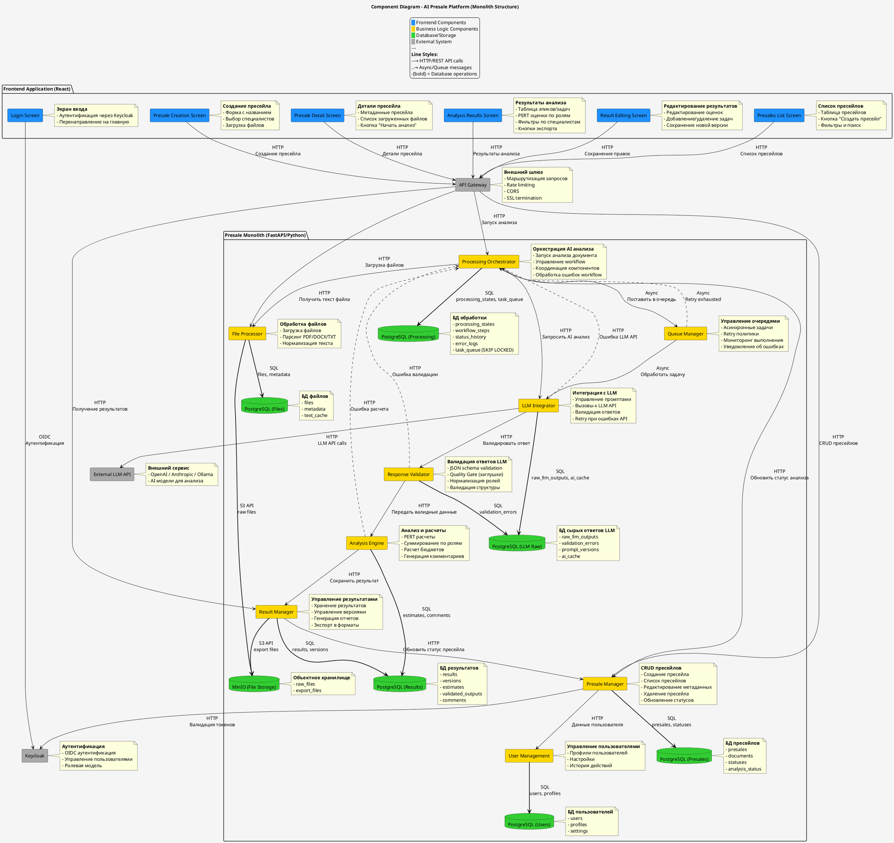

# Архитектурный документ C4: AI-платформа для оценки пресейлов (Python версия)

**Версия:** 3.0 (Python-стек, с учётом VPN)  
**Статус:** Предложено для реализации  
**Дата:** 2026  
**Автор:** Архитектор проекта  
**Нагрузка:** до 600 пресейлов в год (~2 в день)  
**Ключевое требование безопасности:** Все внешние подключения пользователей осуществляются только через корпоративный VPN.  
**Технологический стек:** Исключительно Python экосистема

---

## 1. Контекст системы (C1)

### 1.1. Назначение системы

AI-платформа для автоматизированной оценки трудозатрат на пресейлы. Система анализирует входные документы (PDF, DOCX, TXT) с помощью больших языковых моделей (Large Language Models, LLM) и преобразует неструктурированный текст в две связанные таблицы: декомпозицию работ (User Stories) и оценку трудозатрат по ролям.

### 1.2. Ключевые пользователи

- **Консультанты по пресейлам:** основные пользователи, создают пресейлы, загружают документы, запускают анализ и работают с результатами.
- **Руководители проектов:** проверяют, корректируют и утверждают сгенерированные оценки.
- **Бизнес-аналитики:** анализируют метрики системы и настраивают параметры оценки.

### 1.3. Внешние системы

- **Keycloak:** внешний сервис для аутентификации и управления пользователями по протоколу OIDC.
- **Внешний LLM API:** облачные AI-сервисы (OpenAI, Anthropic, Ollama) для анализа текста.
- **S3-совместимое хранилище (MinIO):** используется для хранения исходных загруженных файлов и экспортированных отчётов.
- **Корпоративный VPN-шлюз:** обязательный пункт входа в систему для всех пользователей.

---

## 2. Контейнеры системы (C2)

### 2.1. Диаграмма контейнеров и сетевые зоны
```puml
@startuml C2_Container_Diagram_VPN
!include https://raw.githubusercontent.com/plantuml-stdlib/C4-PlantUML/master/C4_Container.puml
skinparam backgroundColor transparent

LAYOUT_WITH_LEGEND()

' Сетевые зоны
Boundary(WAN, "WAN", "Интернет") {
  Person(consultant, "Консультант\nпресейлов", "Подключается через VPN")
  Person(manager, "Руководитель\nпроекта", "Подключается через VPN")
  System_Ext(vpn_gateway, "VPN Gateway", "Корпоративный VPN")
}

Boundary(LAN, "LAN", "Внутренняя сеть") {
  Container(frontend, "Frontend", "React/TypeScript", "Веб-интерфейс, 6 экранов")
  Container(api_gateway, "API Gateway", "Nginx", "Маршрутизация API, rate limiting")
  Container(backend, "Backend Monolith", "FastAPI/Python 3.11+", "Модульный монолит, 9 компонентов")
  ContainerDb(postgres, "PostgreSQL", "PostgreSQL 15+", "Основное хранилище данных")
  ContainerDb(minio, "Object Storage", "MinIO", "S3-совместимое хранилище файлов")
  System_Ext(keycloak, "Keycloak", "Аутентификация, управление пользователями")
}

Boundary(External, "External", "Внешние API") {
  System_Ext(llm_provider, "External LLM API", "OpenAI/Anthropic/Ollama")
}

' Связи с учётом VPN
Rel(consultant, vpn_gateway, "Устанавливает защищённое\nVPN-соединение", "IPSec/OpenVPN")
Rel(manager, vpn_gateway, "Устанавливает защищённое\nVPN-соединение", "IPSec/OpenVPN")

Rel(vpn_gateway, frontend, "Доступ после аутентификации", "HTTPS (443)")
Rel_R(frontend, api_gateway, "Вызывает API", "HTTP (8080)")
Rel_D(api_gateway, backend, "Проксирует запросы", "HTTP (8080)")

Rel_R(api_gateway, keycloak, "Валидирует JWT токены", "HTTPS (8443)")
Rel_R(backend, llm_provider, "Вызывает AI-модели", "HTTPS (443)")
  Rel(backend, postgres, "Читает/записывает данные", "SQLAlchemy/asyncpg (5432)")
Rel(backend, minio, "Сохраняет/читает файлы", "S3 API (9000)")

@enduml
```

### 2.2. Сводная таблица контейнеров (с учётом VPN)

| Контейнер | Назначение | Технологический стек | Сетевая зона | Примечания |
|-----------|------------|----------------------|--------------|------------|
| VPN Gateway | Защищённый туннель для доступа пользователей к внутренним ресурсам. | IPSec / OpenVPN / WireGuard | Периметр (WAN) | Обязателен для доступа. Управляется инфраструктурной командой. |
| Frontend (React) | Веб-интерфейс пользователя (6 экранов). | React 18+, TypeScript, Vite, Ant Design | LAN | Доступен только после подключения к корпоративному VPN. |
| API Gateway | Единая точка входа для всех API-вызовов. | Nginx | LAN | Принимает запросы только от Frontend, находящегося во внутренней сети. |
| Backend Monolith | Единое приложение, содержащее всю бизнес-логику. | FastAPI 0.104+, Python 3.11+, SQLAlchemy 2.0 | LAN | Модульный монолит из 9 компонентов на Python. |
| PostgreSQL | Основное реляционное хранилище всех данных. | PostgreSQL 15+ | LAN | 6 логических схем в одном физическом экземпляре. |
| MinIO | Объектное хранилище для файлов документов и отчётов. | MinIO | LAN | S3-совместимое API. |
| Keycloak | Внешний сервис для аутентификации и авторизации. | Keycloak 21+ | External (LAN) | Доступ из внутренней сети. |
| External LLM API | Сторонние AI-сервисы для анализа текста. | OpenAI / Anthropic / Ollama | External (WAN) | Исходящий доступ из LAN через HTTPS. |

---

## 3. Компоненты бэкенд-монолита (C3)

### 3.1. Полная компонентная диаграмма

На схеме ниже представлены все компоненты системы, их связи, базы данных и внешние интеграции.

**Условные обозначения:**
- Синий: Компоненты фронтенда (React)
  - Жёлтый: Компоненты бизнес-логики (FastAPI/Python)
- Зелёный: Базы данных и хранилища
- Серый: Внешние системы
- Сплошная линия: Синхронные HTTP-вызовы
- Пунктирная линия: Асинхронные сообщения через очередь
- Жирная линия: Прямые операции с базами данных



### 3.2. Описание компонентов

| Компонент | Назначение | Ключевые функции | Основные взаимодействия |
|-----------|------------|------------------|------------------------|
| User Management | Управление пользователями и их профилями. | Синхронизация с Keycloak, хранение настроек, ведение истории действий. | Получает запросы от Presale Manager для проверки данных пользователя. |
| Presale Manager | Управление жизненным циклом пресейлов. | Создание, чтение, обновление и удаление пресейлов (CRUD), управление статусами и метаданными. | Основной интерфейс для фронтенда. Валидирует токены через Keycloak. |
| File Processor | Извлечение текста из загруженных документов. | Загрузка файлов, парсинг форматов PDF/DOCX/TXT, нормализация и кэширование текста. | Сохраняет файлы в MinIO, текст — в БД. Предоставляет текст Processing Orchestrator. |
| Processing Orchestrator | Координация всего процесса анализа документа. | Запуск workflow, управление состояниями, централизованная обработка ошибок от всех компонентов. | Инициирует процесс, вызывает File Processor, ставит задачи в Queue Manager. |
| Queue Manager | Управление асинхронным выполнением задач. | Реализация очереди задач на основе PostgreSQL (SKIP LOCKED), политики повторных попыток (retry). | Получает задачи от оркестратора и передаёт их LLM Integrator. |
| LLM Integrator | Взаимодействие с внешними AI-сервисами. | Формирование промптов, вызов API LLM, обработка сетевых ошибок, сохранение сырых ответов. | Вызывает внешний LLM API, передаёт ответ Response Validator. |
| Response Validator | Контроль качества и структуры ответов от LLM. | Валидация JSON-схемы, отсев заглушек (Quality Gate), нормализация ролей (всего 5 допустимых). | Получает сырой ответ от LLM Integrator, передаёт очищенные данные Analysis Engine. |
| Analysis Engine | Расчёт итоговых оценок трудозатрат. | Расчёт по методу PERT, суммирование по ролям, расчёт бюджета, генерация комментариев. | Получает структурированные данные от валидатора, передаёт результаты Result Manager. |
| Result Manager | Работа с финальными результатами оценки. | Сохранение, версионирование, экспорт в различные форматы, управление историей изменений. | Сохраняет рассчитанные оценки, обновляет статус пресейла в Presale Manager. |

---

## 4. Процессы (Workflow)

### 4.1. Основной процесс обработки пресейла

| Этап | Участники (компоненты) | Действие | Результат |
|------|------------------------|----------|-----------|
| 0. Подключение к VPN | Пользователь → VPN Gateway | Установка защищённого VPN-соединения с корпоративной сетью. | Доступ к внутренним ресурсам компании. |
| 1. Создание пресейла | Пользователь → Frontend → Presale Manager | Заполнение формы с метаданными пресейла. | Запись о пресейле в БД со статусом DRAFT. |
| 2. Загрузка документа | Пользователь → File Processor | Загрузка документа. Парсинг и извлечение текста. | Исходный файл в MinIO. Извлечённый текст закэширован в БД. |
| 3. Инициация анализа | Пользователь → Processing Orchestrator → Queue Manager | Запрос на запуск AI-анализа. Создание асинхронной задачи. | Запись задачи в таблицу task_queue со статусом PENDING. |
| 4. AI-обработка | Queue Manager → LLM Integrator → Внешний LLM API | Выбор задачи из очереди. Вызов LLM API с промптом. | "Сырой", неструктурированный ответ LLM сохранён в raw_llm_outputs. |
| 5. Валидация | LLM Integrator → Response Validator | Проверка ответа на соответствие JSON-схеме, качество, нормализация. | Структурированные данные, готовые для расчёта, или запись об ошибке валидации. |
| 6. Расчёт | Response Validator → Analysis Engine | Расчёт оценок по методу PERT, бюджетирование. | Готовый набор оценок по ролям и эпикам. |
| 7. Финализация | Analysis Engine → Result Manager → Presale Manager | Сохранение результатов. Обновление статуса пресейла. | Пресейл переходит в статус COMPLETED. Результаты доступны для просмотра и экспорта. |

### 4.2. Обработка ошибок

Все ошибки, возникающие в процессе, возвращаются в **Processing Orchestrator**, который действует по сценарию:

- **Сетевые ошибки LLM API, временные сбои:** Задача возвращается в очередь для повторной попытки (retry) через Queue Manager.
- **Критические ошибки валидации или расчёта:** Процесс останавливается. Ошибка фиксируется в логах (error_logs). Пресейлу присваивается статус FAILED. Пользователь уведомляется через интерфейс.

---

## 5. Ключевые решения и ограничения

### 5.1. Жёсткие ограничения (обоснованные экспериментами)

| Ограничение | Обоснование |
|-------------|-------------|
| Обязательный VPN для доступа | Требование корпоративной безопасности. Устраняет необходимость размещения компонентов в DMZ и публикации их в интернете. |
| Использование исключительно PostgreSQL | Отказ от внедрения Redis для организации очередей. Очередь реализована на самом PostgreSQL с помощью механизма SELECT ... FOR UPDATE SKIP LOCKED, что минимизирует инфраструктурную сложность для MVP. |
| Монолитная архитектура | Выбор модульного монолита вместо микросервисов для кардинального снижения операционной сложности на этапе запуска (deploy, мониторинг, отладка). |
| Отказ от OCR в MVP | На этапе MVP система работает только с текстовым слоем PDF. Обработка сканированных изображений (Optical Character Recognition, OCR) отложена до появления подтверждённой бизнес-потребности. |
| Отказ от агентских цепочек (Agent Chains) | Архитектура предполагает один целенаправленный запрос к LLM с последующей сложной программной валидацией, а не последовательность LLM-вызовов (чейнов). Это повышает предсказуемость и контролируемость процесса. |
| Фиксированный набор ролей для оценки | Допустимы только 5 предопределённых ролей: Backend-разработчик, Frontend-разработчик, Data-инженер, DevOps-инженер, Системный/Бизнес-аналитик (SA/BA). Это обеспечивает консистентность и сравнимость оценок. |

### 5.2. Критические архитектурные решения

| Решение | Проблема, которую оно решает | Реализация |
|---------|------------------------------|------------|
| Выделение компонента «Валидатор ответов» (Response Validator) | LLM часто возвращают ответ в некорректном формате (текст вместо JSON), с заглушками или вымышленными ролями, что делает автоматическую обработку невозможной. | Создан отдельный компонент, который последовательно выполняет: валидацию JSON-схемы, контроль качества (отсев заглушек), нормализацию названий ролей к утверждённому списку. |
| Обязательное сохранение исходных ответов LLM | Без сохранения "сырых" данных невозможно анализировать причины ошибок валидации и итеративно улучшать шаблоны запросов (prompts). | Все ответы от внешних AI-сервисов безусловно сохраняются в отдельную схему БД (llm_raw.raw_llm_outputs) перед любой попыткой их обработки. |
| Реализация очереди задач на PostgreSQL | Требовалось реализовать асинхронную обработку и механизм повторных попыток без внедрения отдельной брокерской системы (Kafka, RabbitMQ). | Очередь реализована через таблицу processing.task_queue. Компонент Queue Manager использует паттерн SKIP LOCKED для конкурентного безопасного извлечения задач несколькими воркерами. |
| Использование метода PERT для оценок | Точечные оценки не отражают неопределённость, присущую процессу предварительной оценки. | Для каждой задачи оцениваются три значения: оптимистичное, наиболее вероятное и пессимистичное. Итоговая оценка и доверительный интервал рассчитываются по формулам PERT. |

---

## 6. Технологический стек (Python экосистема)

| Категория | Технологии |
|-----------|-------------|
| **Фронтенд** | React 18, TypeScript, Vite, Ant Design, React Router (опционально: Streamlit для прототипирования) |
| **Бэкенд (Python)** | FastAPI 0.104+, Python 3.11+, Uvicorn, SQLAlchemy 2.0, Alembic (миграции), Pydantic 2.0 (валидация) |
| **Аутентификация** | FastAPI Security (OAuth2/OpenID Connect), python-keycloak для интеграции с Keycloak |
| **Обработка файлов** | PyPDF2 / pdfplumber (PDF), python-docx (DOCX), python-magic (определение типов) |
| **Очереди и асинхронность** | Celery + Redis (или PostgreSQL-очередь с asyncpg), APScheduler для планирования |
| **LLM интеграция** | OpenAI Python SDK, Anthropic SDK, LangChain (опционально), httpx для HTTP-клиента |
| **Базы данных** | PostgreSQL 15+ (основное хранилище), MinIO (объектное хранилище, S3-совместимое) |
| **Инфраструктура** | Docker, Docker Compose, Nginx (API Gateway), Poetry (управление зависимостями) |
| **Внешние интеграции** | Keycloak (аутентификация), OpenAI / Anthropic / Ollama API |
| **Безопасность и доступ** | Корпоративный VPN-шлюз (IPSec/OpenVPN), FastAPI CORS middleware |

---

## 7. Заключение

Представленная архитектура обеспечивает баланс между функциональностью, безопасностью, простотой поддержки и возможностью развития в рамках заявленной нагрузки. Ключевые особенности:

- **Соответствие корпоративным стандартам безопасности:** Обязательный VPN, размещение всех сервисов в LAN и многофакторная аутентификация формируют защищённый контур.

- **Сфокусированность на MVP:** Отсечены периферийные функции (OCR, микросервисы, агентские цепочки) для концентрации на проверке гипотезы о полезности LLM в оценке пресейлов.

- **Устойчивость к ошибкам:** Многоуровневая обработка ошибок, асинхронная модель через очередь и обязательное сохранение сырых данных делают систему отказоустойчивой и удобной для отладки.

- **Чёткие границы компонентов:** Модульный монолит позволяет эффективно распределять работу между разработчиками и минимизирует косвенные связи.

- **Эволюционный потенциал:** Архитектура допускает постепенное развитие: добавление OCR-парсера, поддержку новых LLM-провайдеров, выделение компонентов в отдельные сервисы при росте нагрузки.