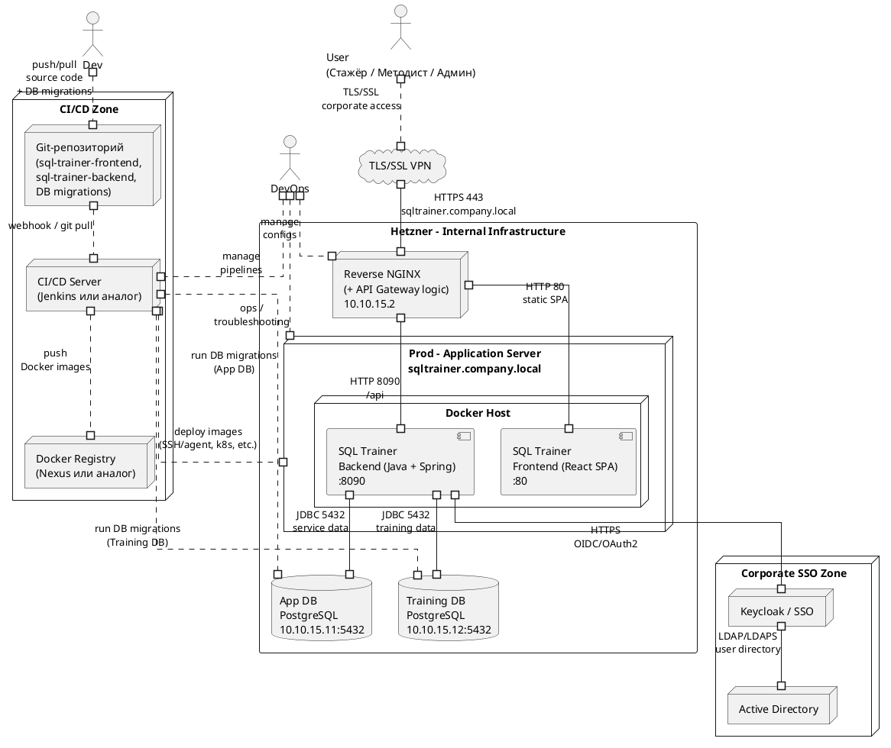

## 6. Эксплуатация, мониторинг и CI/CD

### 6.1. Среды эксплуатации

Для системы SQL Trainer используются следующие среды.

**Dev**

* Назначение: разработка и эксперименты.
* Данные: тестовые аккаунты и небольшие учебные наборы.
* Настройки:

    * значения таймаутов и размеров пулов могут отличаться от Prod и использоваться для отладки;
    * может быть включено более подробное логирование (вплоть до полного SQL и технических деталей).

**Test**

* Назначение: функциональные и базовые нагрузочные тесты.
* Данные: синтетические, приближённые по объёму и структуре к реальным учебным данным.
* Настройки:

    * включён таймаут выполнения учебных SQL-запросов **2 секунды**;
    * размер пула соединений к `Training DB` — **50 соединений**;
    * параметры таймаута и пула вынесены в конфигурацию (env/ConfigMap) и могут корректироваться по результатам тестов;
    * проверяется корректность работы очереди запросов и поведения системы при перегрузке.

**Prod (внутренний учебный стенд)**

* Назначение: реальная работа стажёров и сотрудников.
* Данные: фактические учебные наборы, используемые в задачах.
* Настройки:

    * таймаут выполнения одного SQL-запроса — **2 секунды**;
    * размер пула соединений к `Training DB` — **50 соединений**;
    * при превышении таймаута запрос принудительно обрывается, соединение возвращается в пул, следующий запрос берётся из очереди;
    * значения таймаута и размера пула являются конфигурируемыми параметрами и могут изменяться при эксплуатации на основе метрик и нагрузочного тестирования.

---

### 6.2. Мониторинг

На Prod-среде настраиваются следующие ключевые метрики:

* **Занятость пула соединений к Training DB**

    * текущее количество занятых соединений и размер пула;
    * пороговые значения для алертов (например, >80% соединений занято в течение заданного интервала).

* **Время проверки задач**

    * среднее время проверки задач;
    * 95-й перцентиль времени проверки (включая выполнение SQL и сравнение результата);
    * количество запросов, прерванных по таймауту.

Дополнительно рекомендуется отслеживать:

* количество ошибок аутентификации/авторизации (проблемы с SSO/Keycloak);
* общее число решённых задач в сутки по пользователям (контроль бизнес-метрики **«≥ 20 задач в день на стажёра»**).

---

### 6.3. Логирование и история попыток

Система фиксирует все попытки решения задач.

**Хранение в App DB (история попыток)**

Для каждой попытки решения задачи сохраняются:

* идентификатор пользователя;
* идентификатор задачи;
* время попытки;
* **полный текст SQL-запроса обучающегося**;
* статус проверки (успешно / неверно / частично / прерван по таймауту);
* длительность выполнения запроса.

Назначение:

* анализ типичных ошибок обучающихся методистами;
* улучшение формулировок задач и подсказок;
* разбор инцидентов с производительностью (поиск “тяжёлых” шаблонов запросов).

**Серверные логи Execution-сервиса**

Логи содержат:

* факт начала выполнения запроса (user, task, время старта);
* факт завершения (успех/ошибка/таймаут) и длительность;
* причину прерывания (например, превышен таймаут).

Срок хранения логов и истории попыток определяется корпоративной политикой (например, не менее 3 лет) с возможностью удаления/анонимизации данных по конкретному пользователю по запросу.

---

### 6.4. CI/CD и путь поставки изменений

#### 6.4.1. Репозиторий кода и сборка

* Frontend (`sql-trainer-frontend`, React SPA) и Backend (`sql-trainer-backend`, Java + Spring) хранятся в Git-репозитории.
* При изменениях в основной/релизной ветке выполняется:

    * сборка фронтенда и бэкенда;
    * запуск юнит-тестов и базовых интеграционных тестов;
    * сборка Docker-образов фронтенда и бэкенда;
    * публикация образов в registry (например, Nexus).

#### 6.4.2. Деплой на среды

* **Dev** — автоматический деплой после успешной сборки (для разработчиков и стажёров).
* **Test** — деплой по ручному approve QA/ответственного, запуск функциональных и простых нагрузочных тестов (в т.ч. сценариев проверки SQL и таймаутов).
* **Prod** — деплой только после успешных тестов на Test и ручного approve (архитектор/лид/ответственный).

#### 6.4.3. Миграции БД: куда, для чего и как

Миграции баз данных применяются к двум логическим БД:

* `App DB` — сервисные данные приложения (курсы, задачи, история попыток, отчёты, настройки);
* `Training DB` — учебные схемы и данные, на которых выполняются учебные SQL-запросы.

**Для чего выполняются миграции**

* Для изменения структуры `App DB`:

    * добавление/изменение таблиц (например, новые сущности задач, попыток, отчётов);
    * изменение индексов и ограничений;
    * добавление служебных полей (например, для расширения истории попыток).
* Для изменения структуры и содержимого `Training DB`:

    * создание/изменение учебных схем и таблиц;
    * загрузка/обновление учебных наборов данных, необходимых для новых задач;
    * подготовка отдельных наборов данных для разных курсов.

**Куда применяются миграции**

* На **Dev**:

    * миграции накатываются автоматически при каждом деплое;
    * допускается частое изменение и откат миграций разработчиками.
* На **Test**:

    * миграции накатываются автоматически в рамках CI/CD-пайплайна перед деплоем новой версии приложения;
    * на этой среде проверяется корректность миграций, в т.ч. на приблизительно реальном объёме данных.
* На **Prod**:

    * миграции накатываются в рамках пайплайна перед деплоем новой версии;
    * накатываются только миграции, успешно прошедшие Dev и Test;
    * при необходимости отката версии приложения используется либо обратная миграция (если предусмотрена), либо восстановление данных из резервной копии в соответствии с политикой эксплуатации.

**Как миграции реализуются технически**

* Для миграций используется специализированный инструмент (например, **Flyway** или **Liquibase**), подключённый к `App DB` и `Training DB`.
* Миграции описываются в виде versioned-скриптов и хранятся в том же Git-репозитории, что и код приложения:

    * для `App DB` — преимущественно DDL-скрипты (создание/изменение таблиц, индексов, ограничений) и минимально необходимый DML (служебные справочники, настройки);
    * для `Training DB` — DDL (структура учебных схем) и контролируемый DML (загрузка учебных наборов данных).
* Порядок применения миграций:

    1. CI/CD-пайплайн перед деплоем бэкенда выполняет шаг миграций БД:

        * для среды Dev/Test — автоматически;
        * для Prod — по факту ручного approve релиза.
    2. Инструмент миграций:

        * считывает набор доступных версий;
        * сравнивает с текущим состоянием БД (по служебной таблице версий);
        * применяет недостающие миграции в строгом порядке.
* Требования к миграциям:

    * миграции должны быть **идемпотентными с точки зрения состояний** (каждая версия применяется один раз, состояние фиксируется в служебной таблице);
    * по возможности миграции должны быть **обратно совместимы** с предыдущей версией приложения в рамках одного релиза (чтобы минимизировать риски при откате);
    * для критичных изменений схем `Training DB` перед миграцией должны выполняться резервные копии.

---

### 6.5. Диаграмма деплоя и CI/CD (PlantUML)

