Ок, давай сделаем 7.1 более “инженерным” и добавим схему. Ниже — переписанный раздел целиком с техническими деталями и PlantUML-диаграммой.

---

## 7. Эксплуатация, мониторинг и CI/CD

### 7.1. Среды (Dev / Test / Prod)

Для системы SQL Trainer предусмотрено минимум три среды: **Dev**, **Test** и **Prod (учебный стенд)**.

Во всех средах используется одна и та же базовая архитектура:

* Nginx + статический фронтенд (React SPA);
* backend-сервисы в кластере Kubernetes;
* две базы данных: App DB и Training DB (разные серверы PostgreSQL);
* интеграция с корпоративным SSO (Keycloak/AD).

Отличия между средами заключаются в:

* составе и объёме данных;
* конфигурации ограничений Training DB (таймаут, пул, очередь);
* строгости настроек безопасности и мониторинга;
* правилах деплоя из CI/CD.

---

#### 7.1.1. Dev-среда

**Назначение**

* Среда для повседневной разработки и отладки командой.
* Используется для интеграции новых фич, первичной проверки миграций, экспериментов и отладки сложных кейсов.

**Техническое размещение**

* Отдельный namespace или отдельный кластер Kubernetes: `sql-trainer-dev`.
* Отдельные экземпляры App DB (PostgreSQL) и Training DB (PostgreSQL) с минимально достаточной конфигурацией.
* Отдельный базовый URL, например: `https://sql-trainer-dev.internal.company`.
* Интеграция с Keycloak в отдельном dev-realm или с тестовой клиентской конфигурацией.

**Данные**

* Обезличенные тестовые данные, минимальные по объёму.
* Набор учебных задач и курсов — сокращённый, ориентированный на проверку основных сценариев.

**Настройки Training DB (таймаут, пул, очередь)**

* Таймаут выполнения SQL-запроса может быть увеличен (5–10 секунд) для удобства отладки.
* Размер пула соединений уменьшен (10–20 соединений), чтобы не расходовать лишние ресурсы.
* Очередь запросов может работать в упрощённом режиме или отключаться (ошибка при исчерпании пула), если это помогает отладке.

**Особенности эксплуатации**

* Разрешены частые деплои из CI/CD по merge в ветку `develop`.
* Допускаются временные нестабильности (перезапуски, несовместимые миграции), если заранее известно, что это не затрагивает Test/Prod.
* Логирование и мониторинг могут быть упрощены (расширенный debug-лог, включённый на ограниченное время).

---

#### 7.1.2. Test-среда

**Назначение**

* Среда для интеграционного, регрессионного и нагрузочного тестирования.
* Основная площадка для проверки релиза перед выкатыванием на Prod.

**Техническое размещение**

* Namespace или кластер: `sql-trainer-test`.
* Отдельные экземпляры App DB и Training DB, схожие по конфигурации с Prod, но с меньшими ресурсами.
* Базовый URL, например: `https://sql-trainer-test.internal.company`.
* Используется тестовый realm/клиент в Keycloak, максимально приближенный по конфигурации к Prod.

**Данные**

* Набор учебных данных, близкий по структуре и объёму к Prod, но без реальных персональных и боевых данных.
* Полный или почти полный набор курсов и задач, соответствующих ключевым сценариям использования.

**Настройки Training DB (таймаут, пул, очередь)**

* Таймаут выполнения SQL-запроса — такой же, как на Prod (2 секунды) или близкий к нему.
* Размер пула соединений — такой же, как на Prod (50) либо немного меньше, с сохранением пропорций нагрузки.
* Очередь запросов включена; поведение при переполнении соответствует Prod и явно тестируется.

**Особенности эксплуатации**

* Релизы из CI/CD попадают на Test после прохождения автоматических тестов.
* На Test проводится:

    * проверка корректной работы ограничений Training DB (таймаут, пул, очередь);
    * проверка миграций App DB и Training DB;
    * нагрузочное тестирование с имитацией пиков нагрузки.
* Конфигурация безопасности (доступ только через VPN, интеграция с SSO) максимально повторяет Prod.

---

#### 7.1.3. Prod-среда (учебный стенд)

**Назначение**

* Основная рабочая среда для сотрудников (стажёров, аналитиков, методистов, администраторов).
* Используется для реального обучения, практикумов и регулярной работы стажёров.

**Техническое размещение**

* Namespace или кластер: `sql-trainer-prod`.
* Выделенные сервера App DB и Training DB (PostgreSQL) с ресурсами, рассчитанными на целевую нагрузку.
* Доступ по внутреннему URL, например: `https://sql-trainer.internal.company`.
* Интеграция с боевым realm/клиентом Keycloak, привязанным к корпоративному AD.

**Данные**

* Полноценный набор учебных схем и данных в Training DB.
* Актуальные курсы, модули, задачи и история попыток обучающихся в App DB.
* Отсутствуют боевые клиентские данные и производственные транзакции.

**Настройки Training DB (таймаут, пул, очередь)**

* Таймаут выполнения SQL-запроса: **2 секунды** (KD1).
* Размер пула соединений к Training DB: **50 соединений** (KD1).
* Очередь запросов:

    * включена;
    * максимальная длина и политика при переполнении (отказ/ошибка пользователю) заданы конфигурационно;
    * значения подбираются по результатам нагрузочных тестов на Test.

**Особенности эксплуатации**

* Доступ только из корпоративной сети/VPN по HTTPS через Nginx.
* Любые изменения конфигурации, влияющие на производительность или безопасность (таймаут, пул, очередь, параметры доступа), должны:

    * предварительно обкатываться на Dev и Test;
    * фиксироваться в эксплуатационной документации и при необходимости в AVD/OP.
* Релизы на Prod выполняются из CI/CD только после успешного прохождения тестов и проверки на Test.

---

#### 7.1.4. Схема сред (PlantUML)

Ниже — логическая схема трёх сред для SQL Trainer:

```plantuml
@startuml SQLTrainer_Environments
skinparam monochrome true
skinparam linetype ortho

title Environments – Dev / Test / Prod (SQL Trainer)

' === Dev ===
node "Dev Environment\nsql-trainer-dev" as DEV {
  node "Dev Kubernetes\n(sql-trainer-dev namespace)" as DEV_K8S {
    [Dev Backend Services\nUsers/Courses/Execution/Progress] as DEV_SVC
  }

  node "Dev App DB\nPostgreSQL" as DEV_APP_DB
  node "Dev Training DB\nPostgreSQL" as DEV_TR_DB

  [Dev Nginx + Static UI\nhttps://sql-trainer-dev.internal] as DEV_NGINX
}

' === Test ===
node "Test Environment\nsql-trainer-test" as TEST {
  node "Test Kubernetes\n(sql-trainer-test namespace)" as TEST_K8S {
    [Test Backend Services\nUsers/Courses/Execution/Progress] as TEST_SVC
  }

  node "Test App DB\nPostgreSQL" as TEST_APP_DB
  node "Test Training DB\nPostgreSQL" as TEST_TR_DB

  [Test Nginx + Static UI\nhttps://sql-trainer-test.internal] as TEST_NGINX
}

' === Prod ===
node "Prod Environment\nsql-trainer-prod" as PROD {
  node "Prod Kubernetes\n(sql-trainer-prod namespace)" as PROD_K8S {
    [Prod Backend Services\nUsers/Courses/Execution/Progress] as PROD_SVC
  }

  node "Prod App DB\nPostgreSQL" as PROD_APP_DB
  node "Prod Training DB\nPostgreSQL" as PROD_TR_DB

  [Prod Nginx + Static UI\nhttps://sql-trainer.internal] as PROD_NGINX
}

' === Общие внешние сервисы ===
node "Corporate SSO Zone" as SSO_ZONE {
  [Keycloak / SSO] as KEYCLOAK
  [Active Directory] as AD
}

' === Связи внутри сред ===
DEV_NGINX  - DEV_SVC
DEV_SVC    - DEV_APP_DB
DEV_SVC    - DEV_TR_DB

TEST_NGINX - TEST_SVC
TEST_SVC   - TEST_APP_DB
TEST_SVC   - TEST_TR_DB

PROD_NGINX - PROD_SVC
PROD_SVC   - PROD_APP_DB
PROD_SVC   - PROD_TR_DB

' === Интеграция с SSO (общая) ===
DEV_NGINX  - KEYCLOAK : HTTPS\n(OIDC dev realm)
TEST_NGINX - KEYCLOAK : HTTPS\n(OIDC test realm)
PROD_NGINX - KEYCLOAK : HTTPS\n(OIDC prod realm)

KEYCLOAK - AD : LDAP/LDAPS

@enduml
```

