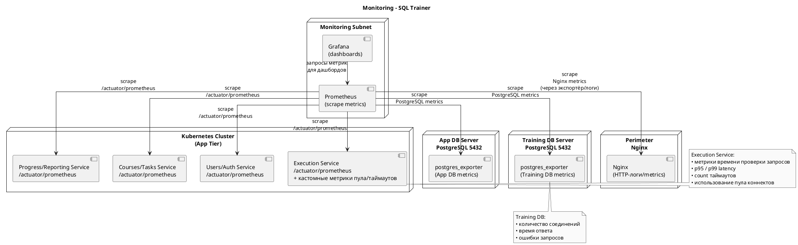

### 7.2. Мониторинг (техническая реализация)

В учебном стенде SQL Trainer используется **базовый стек мониторинга** на уровне приложения и БД:

* **Prometheus** — сбор метрик;
* **Grafana** — дашборды и визуализация;
* **экспортёры и встроенные метрики**:

    * Spring Boot Actuator (`/actuator/prometheus`) для backend-сервисов;
    * `postgres_exporter` для App DB и Training DB;
    * при необходимости — `nginx_exporter` или метрики через лог-анализ.

Мониторинг развёрнут в **отдельной management-сети** или общем корпоративном кластере мониторинга и подключается к SQL Trainer только по внутренним адресам.

---

#### 7.2.1. Подключение компонентов к мониторингу

1. **Backend-сервисы (Users/Auth, Courses/Tasks, Execution, Progress)**

    * Каждый сервис поднимается с включённым **Spring Boot Actuator** и эндпоинтом метрик:

        * `/actuator/prometheus` (HTTP).
    * Prometheus опрашивает эти эндпоинты по внутреннему сервисному DNS/адресам Kubernetes.
    * В Execution Service дополнительно публикуются кастомные метрики:

        * время проверки SQL-запросов (среднее, p95);
        * количество запросов, завершившихся по таймауту;
        * текущее использование пула соединений к Training DB.

2. **Базы данных (App DB и Training DB)**

    * На серверах PostgreSQL развёрнут `postgres_exporter`, отдающий метрики по HTTP (например, порт 9187).
    * Prometheus опрашивает экспортёры и собирает:

        * размеры баз и таблиц;
        * время отклика;
        * количество подключений;
        * количество блокировок / ошибок запросов.

3. **Nginx (периметр)**

    * Включается экспортёр (`nginx_exporter`) или метрики собираются через логи и отдельный collector.
    * Из Nginx полезно собирать:

        * количество запросов в секунду;
        * коды ответов (2xx/4xx/5xx);
        * время ответа.

4. **Prometheus и Grafana**

    * Prometheus периодически (scrape) опрашивает:

        * backend-сервисы (`/actuator/prometheus`);
        * `postgres_exporter` для App DB и Training DB;
        * экспортёр Nginx.
    * Grafana подключается к Prometheus как к источнику данных и отображает дашборды:

        * по Execution/Training DB;
        * по App DB;
        * по общему состоянию сервиса.

---

#### 7.2.2. Ключевые группы метрик

**Для Training DB / Execution Service:**

* использование пула соединений (текущее, максимальное, процент занятости);
* время проверки SQL-запросов (среднее и p95);
* количество запросов, завершившихся по таймауту;
* количество ошибок выполнения SQL.

**Для SSO / авторизации (косвенно):**

* число запросов, отклонённых на уровне Nginx из-за проблем с токенами;
* число ошибок интеграции с Keycloak (по логам/метрикам ошибок HTTP).

**Для продуктовых метрик:**

* количество проверок SQL-запросов в сутки;
* количество решённых задач в сутки на одного обучающегося.

---

#### 7.2.3. Алерты (минимальный набор)

На Prod- и Test-среде настраиваются оповещения (Alertmanager или корпоративный аналог) по, как минимум:

* доля запросов к Training DB, завершившихся по таймауту, превышает порог (например, >5–10% за 5 минут);
* пул соединений к Training DB занят >80% времени;
* рост количества ошибок 5xx от Execution Service;
* рост ошибок 5xx/4xx на уровне Nginx;
* недоступность эндпоинтов `/actuator/prometheus` или `postgres_exporter`.

---

#### 7.2.4. Схема мониторинга (PlantUML)

Вот схематичное представление мониторинга для SQL Trainer:

Так в разделе видно и **что именно мониторим**, и **как это технически устроено**: кто откуда скрапит, какие эндпоинты и экспортёры используются, где рисуются дашборды.
