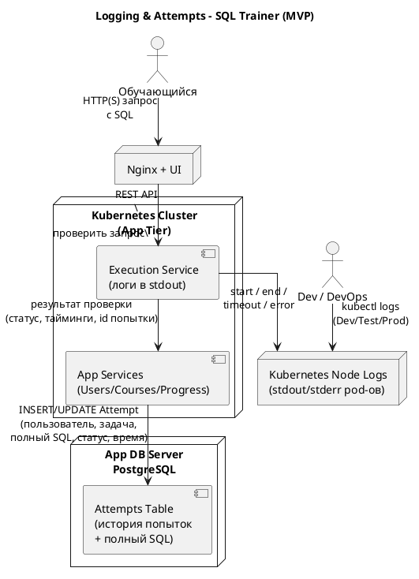

### 7.3. Логирование и история попыток

В SQL Trainer логирование разделено на два уровня:

1. **Данные приложения** — история попыток решения задач в `App DB` (включая полный SQL обучающегося).
2. **Технические логи** — журналы работы backend-сервисов (в первую очередь Execution Service), пишущиеся в stdout контейнеров Kubernetes и читаемые через стандартные инструменты k8s.

---

#### 7.3.1. История попыток в App DB

История попыток хранится в `App DB` как часть доменной модели тренажёра.

**Логическая модель Attempt (упрощённо):**

* ID попытки;
* ID пользователя;
* ID задачи;
* время начала проверки;
* время окончания проверки;
* статус попытки (успешно / частично / неверно / техническая ошибка);
* **полный текст SQL-запроса обучающегося**;
* тип технической ошибки (если есть);
* краткий feedback (если предусмотрен).

Полный SQL хранится именно в App DB (а не в логах), чтобы:

* методисты могли разбирать решения;
* можно было строить отчёты по ошибкам;
* не раздувать технические логи.

---

#### 7.3.2. Технические логи Execution Service

Технические логи нужны Dev/DevOps для диагностики таймаутов, ошибок Training DB и прочих проблем.

**Как пишем:**

* Execution Service логирует через стандартный логгер (Spring Boot / Logback) в **stdout** контейнера.
* Kubernetes сохраняет stdout/stderr подов в лог-файлы на нодах.

**Как читаем:**

* через `kubectl logs` на нужной среде, например:

    * `kubectl logs deployment/execution-service -n sql-trainer-dev`;
    * `kubectl logs pod/<pod-name> -n sql-trainer-prod`.

**Что логируем:**

* старт проверки (ID попытки, ID пользователя/задачи, время, состояние пула/очереди — по необходимости);
* завершение проверки (статус, длительность);
* таймаут (факт, время, состояние пула/очереди);
* ошибки подключения/выполнения в Training DB;
* внутренние исключения.

**Важно:** полный текст SQL в эти логи **не пишется** — он уже есть в Attempt в `App DB`. В лог идёт только ID попытки, по которому при необходимости можно найти SQL в базе.

---

#### 7.3.3. Связь истории попыток и технических логов

Связка простая:

* Execution Service обрабатывает запрос, логирует жизненный цикл проверки в stdout (→ k8s-логи);
* через App Services записывается Attempt в `App DB`;
* по ID попытки можно совместить:

    * “что делал пользователь” — из App DB;
    * “что происходило технически” — из логов `kubectl logs`.

---

#### 7.3.4. Схема логирования (обновлённая)

