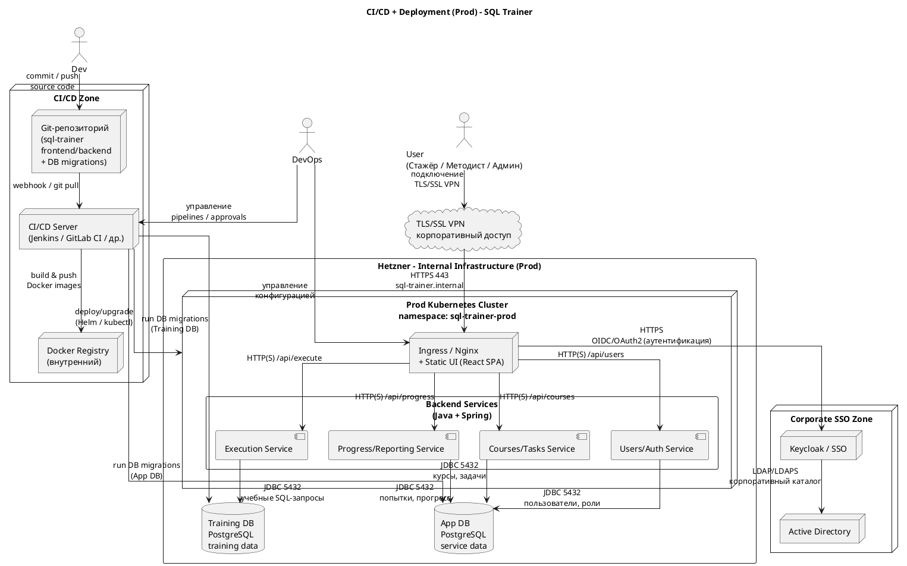

### 7.4. CI/CD и путь поставки изменений

Данный раздел описывает конвейер CI/CD для SQL Trainer и его связь с продовым развёртыванием системы.

---

#### 7.4.1. Общая схема процесса

Изменения в SQL Trainer проходят следующие этапы:

1. **Разработка и работа с Git**

    * Исходный код хранится в Git-репозитории, включающем:

        * frontend (React SPA);
        * backend-сервисы (Users/Auth, Courses/Tasks, Execution, Progress/Reporting);
        * миграции для App DB и Training DB;
        * инфраструктурные манифесты (Helm-chart или kustomize).
    * Разработчики работают в feature-ветках и выполняют merge в:

        * `develop` — для Dev/Test;
        * `main` — для релизных версий (Prod).

2. **Этап CI: сборка и тесты**

   При push/merge в целевые ветки CI-сервер (Jenkins / GitLab CI / иной инструмент) выполняет:

    * Сборку frontend:

        * установка зависимостей;
        * линтеры и unit-тесты;
        * сборка production-бандла SPA.
    * Сборку backend:

        * сборка Java/Spring-проектов;
        * unit-тесты и, при наличии, интеграционные тесты;
        * базовые проверки качества (линтеры, статический анализ — опционально).
    * Проверку инфраструктурных артефактов:

        * lint Helm-chart’ов / манифестов;
        * проверку корректности конфигурационных файлов.

3. **Сборка Docker-образов и публикация**

    * По результатам успешного CI создаются Docker-образы:

        * `sql-trainer-frontend`;
        * `sql-trainer-users`;
        * `sql-trainer-courses`;
        * `sql-trainer-execution`;
        * `sql-trainer-progress`.
    * Образы тегируются (номер версии и/или хэш коммита) и публикуются во внутренний Docker Registry.

4. **Деплой в Kubernetes (Dev / Test / Prod)**

    * **Dev**:

        * автоматический деплой в namespace `sql-trainer-dev` после успешного CI;
        * применение Helm-chart’а/манифестов для Dev;
        * запуск миграций App DB и Training DB для Dev;
        * среда используется разработчиками для ручной проверки и отладки.
    * **Test**:

        * продвижение версии на Test выполняется с ручным подтверждением (manual approve) в CI;
        * деплой в namespace `sql-trainer-test` с использованием конкретного набора образов, прошедшего Dev;
        * запуск миграций App DB и Training DB для Test;
        * выполнение интеграционных и, при необходимости, нагрузочных тестов.
    * **Prod (учебный стенд)**:

        * деплой на Prod выполняется только из версии, прошедшей Test;
        * используется тот же набор образов, что и на Test;
        * применяется конфигурация `sql-trainer-prod`;
        * выполняются миграции App DB и Training DB для Prod;
        * запуск деплоя на Prod требует ручного подтверждения ответственного лица (архитектор/тимлид/владелец продукта).

5. **Роль DevOps**

    * настройка и поддержка pipeline’ов CI/CD;
    * управление Helm-chart’ами и манифестами;
    * настройка ресурсов, переменных окружения, секретов;
    * управление конфигурацией Nginx (раздача статики SPA и маршрутизация API).

---

#### 7.4.2. Учёт миграций баз данных

Миграции для App DB и Training DB являются частью артефактов репозитория и выполняются с помощью стандартного инструмента (например, Flyway или Liquibase):

* для Dev — автоматически при каждом деплое версии;
* для Test — при деплое релизного билда, перед тестированием;
* для Prod — как отдельный шаг пайплайна (или как часть деплоя) с обязательным контролем результата.

Миграции App DB и Training DB выполняются раздельно, чтобы избежать пересечения схем и упростить откат.

---

#### 7.4.3. Схема CI/CD и продового развёртывания (PlantUML)

Данная схема объединяет в одном представлении:

* конвейер CI/CD (Git → CI → Registry → Kubernetes + миграции БД);
* структуру продового окружения (Nginx/Ingress, backend-сервисы, App DB, Training DB, Keycloak/AD, VPN, пользователи).
