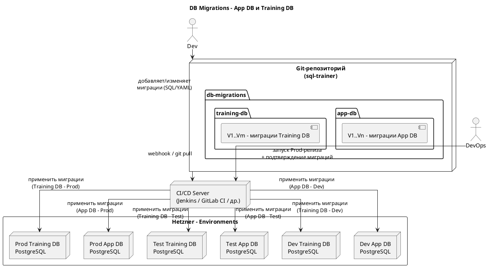

### 7.5. Миграции БД (App DB и Training DB)

Данный раздел описывает, **зачем** нужны миграции для App DB и Training DB, **куда** они применяются и **как** организуется процесс их выполнения в SQL Trainer.

---

#### 7.5.1. Цели миграций

Миграции баз данных нужны для:

1. **App DB (сервисные данные)**

    * создание и изменение схемы таблиц для:

        * пользователей и ролей в контексте тренажёра;
        * курсов, модулей, задач;
        * истории попыток, прогресса и отчётности;
        * технических настроек и справочников;
    * согласованное развитие схемы во всех средах (Dev/Test/Prod).

2. **Training DB (учебные данные)**

    * создание и изменение учебных схем и таблиц, над которыми выполняются SQL-запросы обучающихся;
    * подготовка первоначального набора учебных данных (DDL + минимальные DML-скрипты, если необходимо);
    * поддержка версионирования учебных схем, чтобы команда могла развивать задачи и курсы без ручного “подкручивания” БД.

Миграции позволяют:

* воспроизводимо поднять среды Dev/Test/Prod;
* избежать ручных изменений в схеме БД;
* однозначно понимать, “какая версия схемы” развернута на каждой среде.

---

#### 7.5.2. Организация миграций в репозитории

В Git-репозитории SQL Trainer хранится отдельный каталог для миграций, например:

* `db-migrations/app-db/…` — миграции для App DB;
* `db-migrations/training-db/…` — миграции для Training DB.

Для применения миграций используется типовой инструмент миграций баз данных (далее — **DB Migration Tool**, например Flyway или Liquibase). Принципы одинаковы:

* скрипты миграций **версируются** и нумеруются в порядке применения, например:

    * `V1__init_app_schema.sql`
    * `V2__add_attempts_table.sql`
    * `V3__add_progress_indexes.sql`
* для Training DB — отдельная последовательность, например:

    * `V1__init_training_schema.sql`
    * `V2__add_example_tables.sql`
    * `V3__add_additional_indexes.sql`

Разделение по каталогам и версионным последовательностям обеспечивает независимое развитие `App DB` и `Training DB`.

---

#### 7.5.3. Порядок применения миграций (Dev / Test / Prod)

**Dev-среда**

* При деплое новой версии на Dev (namespace `sql-trainer-dev`) конвейер CI/CD:

    * применяет все неприменённые миграции к **Dev App DB**;
    * применяет все неприменённые миграции к **Dev Training DB**.
* Допускается более частое изменение схемы (включая экспериментальные миграции), при необходимости возможен полный пересоздание Dev-баз.

**Test-среда**

* При продвижении релизной версии на Test (после ручного approve):

    * применяется набор миграций для **Test App DB**;
    * применяется набор миграций для **Test Training DB**.
* На Test обязательно проверяется:

    * успешность применения миграций;
    * отсутствие критичных побочных эффектов (ошибок запросов, деградации базовых сценариев).

**Prod-среда (учебный стенд)**

* Перед деплоем новой версии на Prod:

    * миграции для **Prod App DB** запускаются как отдельный шаг пайплайна;
    * миграции для **Prod Training DB** также запускаются отдельным шагом.
* Миграции Prod применяются **только из версии, уже проверенной на Test**.
* В случае критичных изменений схемы допускается окно обслуживания (в ночное или согласованное время).

---

#### 7.5.4. Резервное копирование и откат

Перед применением миграций к Prod выполняются базовые меры по снижению риска:

1. **Резервное копирование (backup)**

    * Для `App DB`:

        * создаётся логическая резервная копия (например, через `pg_dump`) схемы и данных, которые затрагивают миграции;
        * в случае сложных изменений может выполняться полный backup БД.
    * Для `Training DB`:

        * в зависимости от объёма учебных данных:

            * либо выполняется полный `pg_dump` учебной БД;
            * либо используются отдельные backup-процедуры, если объём данных велик, но структура меняется локально.

2. **План отката**

    * В простых случаях откат может выполняться из reservной копии (restore) при критическом сбое миграций.
    * При подготовке сложных миграций рекомендуются:

        * миграции, поддерживающие “обратное” действие (down-скрипты, если это допускает политика проекта);
        * поэтапное применение (мягкие изменения схемы, а не одномоментная пересборка).

Подробная реализация backup/restore (где именно хранятся дампы, какими скриптами вызываются) фиксируется в эксплуатационной документации и может зависеть от общих практик компании.

---

#### 7.5.5. Схема миграций (PlantUML)

Данный раздел фиксирует:

* что миграции есть **отдельно** для App DB и Training DB;
* что они версионируются и хранятся в Git;
* что применение миграций интегрировано в CI/CD и выполняется раздельно для Dev/Test/Prod с учётом резервного копирования перед Prod.
