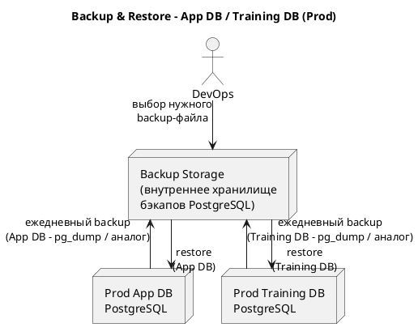

### 7.6. Backup & Restore

Данный раздел описывает базовые подходы к резервному копированию и восстановлению данных для **App DB** и **Training DB** в SQL Trainer, а также ориентировочные цели по RPO/RTO.

---

#### 7.6.1. Цели резервного копирования

Backup & Restore нужны для защиты от:

* аппаратных сбоев серверов БД;
* ошибок миграций и некорректных изменений схемы;
* случайного удаления или порчи данных;
* логических ошибок в приложении, повлёкших неправильные массовые обновления.

Отдельно рассматриваются:

* **App DB** — сервисные данные (пользователи, курсы, задачи, попытки, прогресс, отчёты);
* **Training DB** — учебные схемы и данные, на которых выполняются SQL-запросы обучающихся.

---

#### 7.6.2. Политика резервного копирования App DB

App DB содержит бизнес-значимые данные тренажёра (история попыток, прогресс, отчётность). Потеря этих данных нежелательна, даже несмотря на учебный характер стенда.

**RPO / RTO (для Prod App DB):**

* **RPO (Recovery Point Objective):** до 24 часов
  Допускается потеря не более одного дня активности (задачи и попытки за текущий день), т.к. это учебный стенд.
* **RTO (Recovery Time Objective):** до 4 часов
  В случае серьёзной аварии App DB должна быть восстановлена в течение рабочей смены (например, ночью или утром до начала занятий).

**Подход к резервному копированию (Prod):**

* **Ежедневные логические бэкапы** App DB (например, `pg_dump` всей базы) в ночное время.
* Хранение бэкапов на отдельном сервере/хранилище в корпоративной сети (не на том же диске, что и Prod БД).
* Минимальный срок хранения бэкапов — не менее 30 дней (конкретное значение задаётся эксплуатацией).

**Dev/Test App DB:**

* На Dev/Test строгое резервное копирование не обязательно.
* При необходимости восстановления Dev/Test БД допустимо:

    * пересоздать базу из миграций;
    * при необходимости импортировать подготовленные тестовые дампы.

---

#### 7.6.3. Политика резервного копирования Training DB

Training DB содержит учебные схемы и данные.
Как правило, Training DB может быть **полностью воспроизведена** из:

* миграций `Training DB` (DDL);
* начальных DML-скриптов с учебными данными.

Тем не менее, резервное копирование Training DB желательно для ускорения восстановления и сохранения нестандартных учебных данных (если они создаются вручную).

**RPO / RTO (для Prod Training DB):**

* **RPO:** до 24 часов
  Допускается откат к состоянию учебных данных на начало дня.
* **RTO:** до 4 часов
  Восстановление Training DB не должно блокировать работу тренажёра более одной рабочей смены.

**Подход к резервному копированию (Prod):**

* Ежедневный логический бэкап Training DB (например, `pg_dump`) либо полный бэкап кластера PostgreSQL, если Training DB размещена на выделенном сервере.
* При небольших объёмах учебных данных допускается полное пересоздание базы из миграций и seed-скриптов, а бэкапы использовать как ускоряющий механизм.

**Dev/Test Training DB:**

* Как правило, достаточно пересоздания Training DB из миграций и seed-данных.
* При необходимости можно использовать те же механизмы бэкапов, что и для Prod, но с меньшими сроками хранения.

---

#### 7.6.4. Сценарии восстановления (Restore)

Основные сценарии:

1. **Ошибка миграции App DB или Training DB на Prod**

    * Останавливается деплой, миграции признаются неуспешными.
    * При невозможности безопасного отката миграций с помощью инструмента миграций:

        * выполняется восстановление БД из последнего валидного бэкапа (до миграции);
        * повторный деплой/миграции выполняются после анализа причин.

2. **Логическая ошибка в данных (массовое некорректное обновление)**

    * Если ошибка существенна, допускается восстановление App DB/Training DB из ночного бэкапа.
    * При необходимости возможно:

        * восстановление бэкапа во временную базу;
        * выборочное перенесение корректных данных в текущую Prod БД (по решению эксплуатации/разработки).

3. **Аппаратный сбой сервера БД**

    * Поднимается новый экземпляр PostgreSQL.
    * Выполняется развёртывание схемы через миграции (если нужно) + восстановление данных из последнего бэкапа.
    * Проверяются базовые сценарии работы SQL Trainer.

Конкретные команды и скрипты восстановления (pg_dump/pg_restore, последовательность действий) оформляются в эксплуатационных инструкциях и периодически проверяются на Dev/Test.

---

#### 7.6.5. Схема Backup & Restore (Prod, упрощённо)

Данный раздел фиксирует, что:

* для App DB и Training DB на Prod выполняются регулярные бэкапы с RPO/RTO порядка 24 ч / 4 ч;
* Dev/Test в случае необходимости могут быть пересозданы из миграций;
* операции Backup/Restore выполняются стандартными средствами PostgreSQL, с хранением бэкапов на отдельном внутреннем хранилище и периодической проверкой сценариев восстановления.
